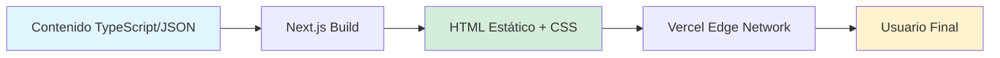

# Diego Gauto - Portfolio Profesional de Arquitectura e IA - Documento de Requerimientos del Producto (PRD)

## 1. Resumen Ejecutivo

- **Objetivo:** Posicionar a Diego Gauto como **Arquitecto de Software & Especialista en IA** mediante un portfolio técnico que demuestre su capacidad de diseñar soluciones de ingeniería escalables ante CTOs, Engineering Managers y Tech Leads de empresas tecnológicas en LATAM y España.
- **Stakeholders:** CTOs, Engineering Managers, Tech Leads de empresas tecnológicas en Argentina, México, Chile, Colombia, España buscando consultoría en arquitectura de software e implementación de IA.
- **Timeline:** 3-4 semanas (desarrollo + optimización)
- **Diferenciación:** Portfolio de **Consultoría Técnica Senior** que demuestra cómo Diego piensa y resuelve problemas de arquitectura complejos, no solo qué tecnologías usa.

---

## 2. Perfiles de Usuario & Necesidad a Resolver

### Perfil 1: CTO de Startup en Crecimiento (LATAM/España)

**Demografía:**
- Edad: 35-50 años
- Ubicación: Buenos Aires, Ciudad de México, Santiago, Madrid, Barcelona
- Empresa: Startup Serie A-B (20-100 empleados)
- Background: Ex-Ingeniero, 8+ años de experiencia técnica

**Necesidad a Resolver:**
"Necesito un arquitecto de software senior que pueda diseñar sistemas escalables con IA sin crear una deuda técnica que nos ahogue cuando crezcamos."

**Puntos de Dolor:**
- ❌ Portfolios genéricos con proyectos "Todo App" sin contexto real de negocio
- ❌ Perfiles que mezclan contenido de marketing con supuesto contenido técnico
- ❌ Falta de evidencia de haber manejado arquitecturas complejas
- ❌ No se entiende el ROI técnico ni el impacto en negocio

**Criterios de Evaluación:**
- ✅ Experiencia demostrable con arquitecturas escalables (microservicios, event-driven)
- ✅ Capacidad de traducir problemas de negocio en soluciones técnicas
- ✅ Conocimiento profundo de IA/ML en producción (no prototipos de laboratorio)
- ✅ Evidencia de sistemas que escalan (métricas reales, cuellos de botella resueltos)

---

### Perfil 2: Engineering Manager en Empresa Tecnológica (LATAM/España)

**Demografía:**
- Edad: 30-45 años
- Ubicación: Córdoba, Medellín, Lima, Valencia, Sevilla
- Empresa: Tech company establecida (100-500 empleados)
- Background: Team lead con expertise en sistemas distribuidos

**Necesidad a Resolver:**
"Necesito un consultor que pueda liderar la integración de IA en nuestros sistemas legacy sin romper todo ni crear silos de conocimiento."

**Puntos de Dolor:**
- ❌ Candidatos que solo conocen la última moda de IA pero sin fundamentos sólidos
- ❌ Falta de experiencia integrando IA con infraestructura existente
- ❌ No entienden la complejidad organizacional (solo ven código)
- ❌ Portfolios que parecen "folletos de agencia creativa"

**Criterios de Evaluación:**
- ✅ Expertise real en LangChain, RAG, OpenAI API (más allá de tutoriales)
- ✅ Experiencia con arquitecturas híbridas (IA + sistemas tradicionales)
- ✅ Capacidad de documentar decisiones arquitectónicas con claridad
- ✅ Comunicación técnica efectiva (diagramas, casos de estudio)

---

### Perfil 3: Tech Lead en Producto SaaS (LATAM/España)

**Demografía:**
- Edad: 28-40 años
- Ubicación: Empresa remote-first (LATAM/España)
- Empresa: SaaS B2B (15-80 empleados)
- Background: Full-stack senior buscando especialización en IA

**Necesidad a Resolver:**
"Necesito un experto que pueda diseñar e implementar flujos agentic sin que mi equipo tenga que leer 200 papers académicos de investigación."

**Puntos de Dolor:**
- ❌ Expertos académicos sin experiencia práctica productizando IA
- ❌ Desarrolladores que solo saben usar APIs sin entender qué ocurre internamente
- ❌ Falta de código o arquitecturas verificables (todo es texto genérico)
- ❌ No queda claro si puede trabajar colaborativamente o solo individualmente

**Criterios de Evaluación:**
- ✅ Casos de estudio verificables con arquitecturas documentadas
- ✅ Conocimiento profundo de Agentic Workflows (LangGraph, AutoGPT, CrewAI)
- ✅ Stack moderno (Python, Node.js, TypeScript, Cloud)
- ✅ Portfolio que inspire confianza técnica y autoridad profesional

---

## 3. Requerimientos Funcionales

| ID | Feature | Descripción | Prioridad | Referencias |
|----|---------|-------------|-----------|-------------|
| **F1** | **Hero - Propuesta de Valor** | Mensaje claro: "Arquitecto de Software & Especialista en IA. Diseño sistemas escalables que resuelven problemas reales de negocio." | P0 | [leerob.io](https://leerob.io), [brittanychiang.com](https://brittanychiang.com) |
| **F2** | **Matriz de Stack Técnico** | Organización en categorías profesionales: Lenguajes (Python, Node.js, TypeScript, SQL), Frameworks de IA (LangChain, OpenAI API, RAG, LangGraph), Arquitectura (Microservicios, Cloud AWS/GCP, API Design, Event-Driven) | P0 | - |
| **F3** | **Casos de Estudio de Arquitectura** | 4-6 casos de estudio técnicos con: Desafío de negocio, Arquitectura propuesta (diagrama), Decisiones técnicas justificadas, Stack seleccionado, Impacto medible | P0 | - |
| **F4** | **Perfil Profesional** | Biografía técnica (150 palabras máx) enfocada en expertise arquitectónico, especialización en IA y enfoque consultivo | P1 | [leerob.io/about](https://leerob.io/about) |
| **F5** | **CTA Consultoría** | Call-to-action con formulario de calificación previo (filtrar leads) antes de agendar reunión técnica. Incluye LinkedIn + Email como alternativas | P0 | - |
| **F6** | **Optimización SEO** | Meta tags, OpenGraph, sitemap, robots.txt, performance (Lighthouse 98-100) | P1 | - |
| **F7** | **Modo Oscuro** | Toggle dark/light mode con persistencia en localStorage | P2 | [brittanychiang.com](https://brittanychiang.com) |

**Prioridades:**
- **P0:** Crítico - MVP no funciona sin esto
- **P1:** Importante - Necesario para lanzamiento
- **P2:** Deseable - Nice to have, post-lanzamiento

---

## 4. Arquitectura Técnica

### 4.1 Stack Tecnológico

**Framework & Core:**
- **Next.js** (Última versión estable con App Router, TypeScript estricto, Static Site Generation)
- **TypeScript** (modo estricto, zero `any`)
- **pnpm** (gestor de paquetes eficiente)

**Estilos:**
- **CSS Modules** (`.module.css` por componente, scope local automático)
- **Variables CSS Globales** (`globals.css` para design tokens: colores, espaciados, tipografía)
- **CSS Grid + Flexbox** (layouts responsive nativos)
- **⛔ PROHIBIDO:** Tailwind CSS o cualquier framework CSS de utilidades
- **Objetivo:** Bundle CSS < 50KB, control total sobre estilos, zero dependencias CSS

**Gestión de Contenido:**
- **100% Local SSG** (Static Site Generation con archivos `.ts` o `.mdx` locales)
- **Content Collections** (casos de estudio definidos en archivos TypeScript locales)
- **Markdown/MDX** (para descripciones técnicas extensas, procesado en build time)
- **⛔ PROHIBIDO:** Bases de datos externas (Supabase, Firebase, etc.) para contenido estático

**UI/UX:**
- **Componentes Custom** (implementados desde cero con CSS Modules)
- **Iconos:** SVG inline o símbolos Unicode (evitar dependencias)
- **Inter Font** (tipografía profesional de Google Fonts)

**Analytics & SEO:**
- **Vercel Analytics** (seguimiento de performance)
- **Metadata API Nativa de Next.js** (meta tags, OpenGraph, structured data)
- **Google Search Console** (indexación y SEO)

**Deployment & Hosting:**
- **Vercel** (hosting gratuito, edge network, auto-deploy desde GitHub)
- **GitHub Pages** (alternativa gratuita si se prefiere)
- **Dominio Custom** (diegogauto.dev o arquitectura-ia.com)

**DevOps:**
- **GitHub Actions** (CI/CD: lint, type-check, build)
- **ESLint + Prettier** (código consistente)
- **Husky** (pre-commit hooks)

---

### 4.2 Arquitectura del Sistema

**Tipo de Aplicación:** Static Site Generation (SSG) con hidratación mínima

**Flujo de Generación:**


**Ventajas de SSG:**
- ⚡ Performance máximo (Lighthouse 98-100 obligatorio)
- 💰 Hosting gratuito (Vercel/GitHub Pages)
- 🔒 Seguridad (sin backend, sin base de datos)
- 🌍 SEO optimizado (HTML estático, totalmente crawleable)

---

### 4.3 Estructura de Carpetas

```
diego-gauto-portfolio/
├── public/
│   ├── images/
│   │   ├── case-studies/              # Diagramas de arquitectura
│   │   │   ├── architecture-1.svg
│   │   │   ├── architecture-2.svg
│   │   │   └── flow-diagram-1.svg
│   │   ├── avatar.webp                # Foto profesional
│   │   └── og-image.png               # OpenGraph image
│   ├── cv-diego-gauto.pdf             # CV descargable
│   ├── robots.txt
│   └── sitemap.xml
├── src/
│   ├── app/
│   │   ├── layout.tsx                 # Root layout (meta tags, fonts)
│   │   ├── page.tsx                   # Home page (one-page design)
│   │   ├── globals.css                # Variables CSS globales + reset
│   │   └── not-found.tsx              # 404 page
│   ├── components/
│   │   ├── sections/
│   │   │   ├── Hero.tsx               # F1: Hero con propuesta de valor
│   │   │   ├── TechStack.tsx          # F2: Matriz de Stack Técnico
│   │   │   ├── CaseStudies.tsx        # F3: Casos de Estudio
│   │   │   ├── About.tsx              # F4: Perfil Profesional
│   │   │   └── Contact.tsx            # F5: CTA Consultoría
│   │   ├── ui/
│   │   │   ├── Button.tsx             # Componente reutilizable
│   │   │   ├── Card.tsx               # Card para casos de estudio
│   │   │   ├── Badge.tsx              # Badges para tecnologías
│   │   │   └── ThemeToggle.tsx        # F7: Dark mode toggle
│   │   └── layout/
│   │       ├── Header.tsx             # Header minimalista
│   │       └── Footer.tsx             # Footer simple
│   ├── data/
│   │   ├── case-studies.ts            # Casos de estudio de arquitectura
│   │   ├── tech-stack.ts              # Matriz de tecnologías
│   │   └── personal-info.ts           # Datos personales
│   ├── lib/
│   │   └── utils.ts                   # Funciones helper (cn, etc)
│   └── types/
│       └── index.ts                   # TypeScript interfaces
├── .github/
│   └── workflows/
│       └── ci.yml                     # GitHub Actions CI
├── .eslintrc.json
├── .prettierrc

├── tsconfig.json
├── next.config.js
├── package.json
└── README.md
```

---

### 4.4 Modelo de Contenido - Casos de Estudio de Arquitectura

**Interface CaseStudy:**
```typescript
interface CaseStudy {
  id: string;                           // Identificador único
  title: string;                        // Título del caso de estudio
  tagline: string;                      // Descripción corta (1 línea)
  
  // Contexto de Negocio
  businessContext: {
    industry: string;                   // Ej: "Fintech", "E-commerce"
    companySize: string;                // Ej: "50-200 empleados"
    challenge: string;                  // Desafío de negocio (2-3 líneas)
  };
  
  // Desafío Técnico
  technicalChallenge: {
    problem: string;                    // Problema técnico detallado
    constraints: string[];              // Ej: ["Budget limitado", "6 semanas"]
    requirements: string[];             // Requerimientos funcionales/no funcionales
  };
  
  // Solución Arquitectónica
  solution: {
    approach: string;                   // Enfoque arquitectónico tomado
    architectureDiagram: string;        // URL a diagrama SVG/PNG
    keyDecisions: {
      decision: string;                 // Decisión arquitectónica
      rationale: string;                // Por qué se tomó esta decisión
      alternatives: string;             // Alternativas consideradas
    }[];
    techStack: string[];                // Stack técnico seleccionado
  };
  
  // Impacto y Resultados
  impact: {
    metrics: {
      metric: string;                   // Ej: "50% reducción latencia"
      description: string;              // Contexto del impacto
    }[];
    businessOutcome: string;            // Resultado de negocio
  };
  
  // Metadata
  year: number;                         // Año de desarrollo
  featured: boolean;                    // Destacado en home
  tags: string[];                       // Ej: ["Microservicios", "IA", "Cloud"]
}
```

**Interface TechStack:**
```typescript
interface TechCategory {
  category: string;                     // Ej: "Lenguajes", "Frameworks de IA"
  technologies: {
    name: string;                       // Ej: "Python"
    level: "experto" | "avanzado" | "intermedio";
    yearsOfExperience: number;          // Años de experiencia
    description?: string;               // Descripción opcional
  }[];
}
```

---

### 4.5 Secciones del Portfolio - Especificación Detallada

#### F1: Hero - Propuesta de Valor

**Contenido:**
- **Headline:** "Diego Gauto"
- **Tagline:** "Arquitecto de Software & Especialista en IA"
- **Propuesta de Valor:** "Diseño sistemas escalables y soluciones de IA que resuelven problemas reales de negocio."
- **Subtítulo:** "Consultoría técnica senior para empresas de tecnología en LATAM y España."
- **CTA Primary:** "Ver Casos de Estudio" (scroll a F3)
- **CTA Secondary:** "Agendar Consultoría" (scroll a F5)
- **Visual:** Avatar profesional + background minimalista (gradiente sutil)

**Diseño:**
- Layout: Centrado, minimalista, enfoque en texto
- Tipografía: Inter Bold (Headline), Inter Regular (Tagline)
- Animación: Fade-in suave (Framer Motion)
- Inspiración: [leerob.io](https://leerob.io) (simplicidad) + [brittanychiang.com](https://brittanychiang.com) (clean design)

---

#### F2: Matriz de Stack Técnico

**Estructura:**
```
┌─────────────────────────────────────────┐
│   Lenguajes de Programación            │
│   ● Python (8 años)                     │
│   ● Node.js / TypeScript (6 años)       │
│   ● SQL (7 años)                        │
├─────────────────────────────────────────┤
│   Frameworks de IA                      │
│   ● LangChain / LangGraph               │
│   ● OpenAI API / Anthropic Claude       │
│   ● RAG (Retrieval-Augmented Gen)       │
│   ● Vector Databases (Pinecone, Weaviate)│
├─────────────────────────────────────────┤
│   Arquitectura & Cloud                  │
│   ● Microservicios / Event-Driven       │
│   ● AWS / GCP                           │
│   ● Docker / Kubernetes                 │
│   ● API Design (REST, GraphQL, gRPC)    │
└─────────────────────────────────────────┘
```

**Diseño:**
- Grid de 3 columnas en desktop, 1 columna en mobile
- Badges interactivos (hover effect)
- Años de experiencia visibles
- Código de colores por categoría

---

#### F3: Casos de Estudio de Arquitectura (REQUERIMIENTOS CRÍTICOS)

**Enfoque:** En lugar de galería de proyectos con screenshots, esta sección presenta **cómo Diego piensa y resuelve problemas de arquitectura complejos**.

**Cada caso de estudio DEBE incluir:**

1. **Reto Técnico** (Technical Challenge)
   - Descripción del problema técnico específico
   - Restricciones (presupuesto, tiempo, recursos)
   - Requerimientos funcionales y no funcionales
   - Por qué el problema era difícil/interesante
2. **Decisiones de Arquitectura** (Trade-offs)
   - Decisiones clave tomadas (mínimo 2-3 por caso)
   - **Trade-offs** considerados para cada decisión
   - Alternativas evaluadas y por qué fueron descartadas
   - Justificación técnica de cada elección
   Ejemplo: "LangGraph vs AutoGPT: Elegí LangGraph por control granular del estado (trade-off: más código boilerplate)"

3. **Implementación de IA** (AI Implementation)
   - Si el caso incluye IA: framework usado, arquitectura de agentes, RAG strategy
   - Prompting engineering, embeddings, vector databases
   - Manejo de errores y fallbacks

4. **Resultados de Negocio** (Business Results)
   - Métricas cuantificables (porcentajes, números concretos)
   - Impacto en negocio (ahorro de costos, mejora de revenue, etc.)
   - ROI técnico demostrable

**Estructura Visual por Caso de Estudio:**
```markdown
┌────────────────────────────────────────────┐
│  **Título del Caso de Estudio**            │
│  Tagline técnico (1 línea)                 │
├────────────────────────────────────────────┤
│  📊 Contexto de Negocio                    │
│  • Industria: Fintech                      │
│  • Tamaño: 50-200 empleados                │
│  • Desafío: [Problema de negocio]          │
├────────────────────────────────────────────┤
│  🔧 RETO TÉCNICO                           │
│  • Problema: [Descripción técnica]         │
│  • Restricciones: Budget, tiempo, equipo   │
│  • Requerimientos: Performance, escala     │
│  • Complejidad: Por qué era difícil        │
├────────────────────────────────────────────┤
│  [Diagrama de Arquitectura - SVG]          │
├────────────────────────────────────────────┤
│  💡 DECISIONES DE ARQUITECTURA             │
│  • Decisión 1: X vs Y                      │
│    ├─ Elegí: X                             │
│    ├─ Trade-off: Más complejo, mejor perf  │
│    └─ Descartadas: Y (razón), Z (razón)   │
│  • Decisión 2: Patrón A vs Patrón B        │
│    ├─ Elegí: Patrón A                      │
│    ├─ Trade-off: Mayor acoplamiento        │
│    └─ Descartadas: Patrón B (razón)       │
├────────────────────────────────────────────┤
│  🤖 IMPLEMENTACIÓN DE IA                   │
│  • Framework: LangGraph                    │
│  • Arquitectura: Multi-agent con RAG       │
│  • Vector DB: Pinecone (por qué)           │
│  • Prompting: Few-shot + Chain-of-thought  │
│  • Fallbacks: Escalado a humano si falla   │
├────────────────────────────────────────────┤
│  📈 RESULTADOS DE NEGOCIO                  │
│  • 70% reducción tiempo de aprobaciones    │
│  • $50K ahorro anual en costos operativos  │
│  • 95% precisión en decisiones automatizadas│
│  • ROI: 300% en primer año                 │
└────────────────────────────────────────────┘
```

**Casos de Estudio Sugeridos (Ejemplos):**

1. **Plataforma de Automatización con Agentes de IA**
   - Contexto: Startup SaaS B2B (30 empleados)
   - Desafío Técnico: Reducir intervención manual en aprobaciones
   - Solución: LangGraph + RAG + OpenAI API
   - Decisiones Clave: Por qué LangGraph vs AutoGPT, gestión de estado de agentes
   - Impacto: 70% reducción tiempo de aprobaciones, $50K ahorro anual
   
2. **Sistema de Soporte con IA (RAG sobre Documentación)**
   - Contexto: E-commerce (100 empleados)
   - Desafío Técnico: Escalar soporte sin contratar agentes
   - Solución: RAG + Vector Database + Embeddings
   - Decisiones Clave: Pinecone vs Weaviate, chunking strategy, prompt engineering
   - Impacto: 50% reducción tickets L1, NPS +15 puntos
   
3. **Migración de Monolito a Microservicios**
   - Contexto: Fintech (80 empleados)
   - Desafío Técnico: Migrar sin downtime ni riesgo regulatorio
   - Solución: Strangler Fig Pattern + Event-Driven Architecture
   - Decisiones Clave: Kafka vs RabbitMQ, bounded contexts, deployment strategy
   - Impacto: 3x mejora en deployment frequency, 0 downtime
   
4. **Pipeline de Datos en Tiempo Real**
   - Contexto: AdTech (50 empleados)
   - Desafío Técnico: Procesar 10K eventos/segundo con baja latencia
   - Solución: Kafka + Stream Processing + Time-Series DB
   - Decisiones Clave: Flink vs Spark Streaming, partitioning strategy, schema evolution
   - Impacto: <100ms latencia p95, escalado a 50K eventos/seg

**Diseño:**
- Layout: Card expandible (accordion o modal)
- Diagramas de arquitectura vectoriales (SVG) con zoom
- Código de colores para destacar decisiones técnicas
- Tooltip en decisiones clave para ver alternativas consideradas

---

#### F4: Perfil Profesional

**Contenido (Tono Consultor Senior):**
```
Arquitecto de Software con más de 8 años de experiencia diseñando 
sistemas escalables para empresas de tecnología en LATAM y España.

Especializado en la integración de soluciones de IA (LangChain, RAG, 
Agentic Workflows) en arquitecturas existentes, con foco en resultados 
medibles de negocio.

He trabajado con equipos de ingeniería de 5 a 200 personas, liderando 
migraciones de arquitectura, diseño de microservicios y optimización 
de performance en producción.

Mi enfoque es traducir desafíos de negocio en soluciones técnicas 
sostenibles, sin crear deuda técnica que ahogue el crecimiento.

[Descargar CV]
```

**Diseño:**
- Layout: 2 columnas (texto + foto profesional)
- Tipografía legible (Inter Regular)
- Background sutil diferenciado
- Link a CV en PDF

---

#### F5: CTA Consultoría (FLUJO CON CALIFICACIÓN)

**Contenido (Enfoque Consultoría):**
- **Headline:** "¿Listo para Escalar tu Arquitectura?"
- **Subheadline:** "Ofrezco consultoría técnica senior en arquitectura de software e implementación de IA para empresas de tecnología."
- **Servicios:**
  - Revisión de arquitectura existente
  - Diseño de soluciones escalables con IA
  - Implementación de Agentic Workflows
  - Migración de monolitos a microservicios

**Flujo de CTA (CON CALIFICACIÓN):**

1. **Botón Primary:** "Agendar Reunión Técnica"
   → Al hacer clic, se abre un **formulario de calificación breve** (modal o sección expandible)

2. **Formulario de Calificación** (filtrar leads):
   ```
   Campos:
   - Nombre completo*
   - Email corporativo*
   - Empresa*
   - Rol* (dropdown: CTO, Engineering Manager, Tech Lead, Otro)
   - Tamaño del equipo* (dropdown: 1-10, 11-50, 51-200, 200+)
   - Desafío principal* (text area, máx 200 caracteres)
     Ej: "Necesitamos integrar IA en sistema legacy sin romper funcionalidad"
   - ¿Cuándo necesitas la solución?* (dropdown: Urgente <1 mes, 1-3 meses, 3-6 meses, Exploratorio)
   
   Botón: "Continuar a Calendario" → Redirige a Calendly pre-poblado
   ```

3. **Alternativas (sin formulario):**
   - **Botón Secondary:** "Conectar en LinkedIn" (link directo)
   - **Link:** Email profesional (diego@example.com)

**Lógica de Calificación:**
- Formulario envía datos a servicio (Formspree, Google Forms API, o Tally)
- Después de enviar, redirige a Calendly con parámetros UTM
- Datos se almacenan para análisis posterior (opcional)

**Diseño:**
- Layout: Centrado, enfoque en CTA
- Botón grande y claro "Agendar Reunión Técnica"
- Modal/expandible para formulario (no redirigir a otra página)
- LinkedIn badge visible como alternativa
- Email visible como fallback
- Mensaje: "Este formulario me ayuda a preparar mejor nuestra conversación"

---

### 4.6 Principios de Diseño (Diferenciación vs diegogauto.com)

| Aspecto | diegogauto.com (Actual) | Portfolio Técnico (Nuevo) |
|---------|-------------------------|---------------------------|
| **Idioma** | Español (emprendedores) | Español profesional (técnico) |
| **Tono** | Emprendedor, motivacional | Consultor Senior, autoridad técnica |
| **Audiencia** | Fundadores, emprendedores | CTOs, Engineering Managers (LATAM/España) |
| **Enfoque** | Inspirar, motivar | Demostrar expertise técnico |
| **Proyectos** | ¿Apps terminadas? | Casos de estudio de arquitectura |
| **Colores** | Vibrantes, cálidos | Neutros, minimalistas, profesionales |
| **Contenido** | Historias, copywriting | Arquitecturas, diagramas, métricas |
| **CTA** | "Agenda una llamada" | "Agendar Consultoría Técnica" |
| **Posicionamiento** | "Busco ayudarte" | "Ofrezco soluciones de arquitectura" |
| **Estructura** | Multi-página, marketing | One-page, portfolio técnico |

**Paleta de Colores (Sugerencia):**
- **Light Mode:** Blanco (#FFFFFF), Gris claro (#F5F5F5), Negro (#1A1A1A), Acento Azul Profesional (#2563EB)
- **Dark Mode:** Negro suave (#0A0A0A), Gris oscuro (#1F1F1F), Blanco (#FFFFFF), Acento Azul (#3B82F6)

---

## 5. Requerimientos No Funcionales

### 5.1 Performance

- **Lighthouse Score:** **98-100 (obligatorio)** en todas las métricas (Performance, Accessibility, Best Practices, SEO)
- **First Contentful Paint (FCP):** **< 0.8s**
- **Time to Interactive (TTI):** **< 1.8s**
- **Total Page Size:** < 500KB (optimizar imágenes con WebP/AVIF, diagramas SVG)
- **JavaScript Bundle:** < 100KB (minimizar interactividad, preferir SSG)

### 5.2 SEO

- **Meta Tags:** Título, Descripción, Keywords optimizados para LATAM/España
- **OpenGraph:** Image, Title, Description para redes sociales
- **Structured Data:** JSON-LD para Person schema (arquitecto de software)
- **Sitemap:** sitemap.xml generado automáticamente
- **Robots.txt:** Permitir crawling de todas las páginas
- **Canonical URLs:** Evitar contenido duplicado
- **Keywords Objetivo:** "Arquitecto de Software LATAM", "Especialista IA", "Consultoría Arquitectura Software"

### 5.3 Accesibilidad

- **WCAG 2.1 Level AA:** Cumplimiento mínimo
- **Navegación por Teclado:** Todas las interacciones accesibles sin mouse
- **Screen Readers:** ARIA labels correctos
- **Contraste de Color:** Mínimo 4.5:1 (texto estándar)

### 5.4 Compatibilidad de Navegadores

- **Navegadores Modernos:** Chrome, Firefox, Safari, Edge (últimas 2 versiones)
- **Mobile:** iOS Safari 14+, Chrome Android 90+
- **Responsive:** Mobile-first design (breakpoints: 640px, 768px, 1024px, 1280px)

---

## 6. Arquitectura de Información

**Estructura One-Page (Scroll vertical):**
```
┌─────────────────────────────────┐
│  Header (Fixed)                 │  ← Logo + Modo Oscuro
├─────────────────────────────────┤
│  F1: Hero - Propuesta de Valor  │  ← Arquitecto de Software & IA
├─────────────────────────────────┤
│  F2: Matriz de Stack Técnico    │  ← Expertise técnico organizado
├─────────────────────────────────┤
│  F3: Casos de Estudio           │  ← 4-6 casos de arquitectura
│     de Arquitectura             │     con diagramas y decisiones
├─────────────────────────────────┤
│  F4: Perfil Profesional         │  ← Biografía consultor senior
├─────────────────────────────────┤
│  F5: CTA Consultoría            │  ← Agendar reunión + LinkedIn
├─────────────────────────────────┤
│  Footer                         │  ← Copyright + Links
└─────────────────────────────────┘
```

**Navegación:**
- Header fijo con scroll-spy (destaca sección activa)
- Smooth scroll entre secciones
- Mobile: Hamburger menu con links a secciones

---

## 7. Casos Límite y Manejo de Errores

| Escenario | Comportamiento Esperado |
|-----------|-------------------------|
| **JavaScript deshabilitado** | Contenido 100% visible (SSG, HTML estático) |
| **Imágenes/Diagramas no cargan** | Alt text descriptivo + placeholder SVG |
| **Link externo roto** | Validar links en CI/CD, mostrar warning en dev |
| **Dark mode sin preferencia** | Detectar `prefers-color-scheme` del sistema |
| **Conexión lenta** | Lazy loading de imágenes, skeleton loaders |
| **404 Not Found** | Página 404 custom con link a home |
| **PDF CV no disponible** | Mostrar mensaje "CV disponible próximamente" |

---

## 8. Estrategia de Deployment

### 8.1 Ambientes

- **Development:** `localhost:3000` (pnpm dev)
- **Preview:** Vercel preview deployments (automático en PRs)
- **Production:** `diegogauto.dev` o `arquitectura-ia.com`

### 8.2 Pipeline CI/CD (GitHub Actions)

```yaml
name: CI/CD Portfolio

on:
  push:
    branches: [main]
  pull_request:
    branches: [main]

jobs:
  lint-and-build:
    runs-on: ubuntu-latest
    steps:
      - uses: actions/checkout@v4
      - uses: pnpm/action-setup@v2
      - uses: actions/setup-node@v4
        with:
          node-version: 20
          cache: 'pnpm'
      - run: pnpm install --frozen-lockfile
      - run: pnpm lint
      - run: pnpm type-check
      - run: pnpm build
      
  deploy:
    needs: lint-and-build
    if: github.ref == 'refs/heads/main'
    runs-on: ubuntu-latest
    steps:
      - uses: actions/checkout@v4
      - uses: amondnet/vercel-action@v25
        with:
          vercel-token: ${{ secrets.VERCEL_TOKEN }}
          vercel-org-id: ${{ secrets.VERCEL_ORG_ID }}
          vercel-project-id: ${{ secrets.VERCEL_PROJECT_ID }}
```

### 8.3 Opciones de Hosting

**Opción 1: Vercel (Recomendado)**
- ✅ Auto-deploy desde GitHub
- ✅ Edge network global (LATAM coverage)
- ✅ Analytics incluido
- ✅ SSL automático
- ✅ Plan gratuito suficiente

**Opción 2: GitHub Pages**
- ✅ 100% gratuito
- ✅ Custom domain soportado
- ⚠️ No edge network
- ⚠️ Requiere configuración manual de Next.js (exportación estática)

**Recomendación:** Vercel por simplicidad y performance en LATAM.

---

## 9. Definition of Done (DoD)

Un feature/sección se considera completa cuando:

- [ ] **Código implementado** siguiendo arquitectura definida
- [ ] **TypeScript estricto** sin errores ni `any`
- [ ] **Responsive** en mobile, tablet, desktop (probado en DevTools)
- [ ] **Accesibilidad** validada (WAVE o axe DevTools)
- [ ] **Lighthouse Score** 98-100 (obligatorio) en todas las métricas
- [ ] **Imágenes/Diagramas optimizados** (SVG para diagramas, WebP para fotos)
- [ ] **SEO** meta tags correctos (probado con OpenGraph preview)
- [ ] **Contenido en español** revisado (ortografía y gramática)
- [ ] **Code review** aprobado (si trabajo en equipo)
- [ ] **Deployed a preview** y validado visualmente
- [ ] **Cross-browser testing** (Chrome, Firefox, Safari)

---

## 10. Roadmap de Implementación

### Fase 1: Setup & Infraestructura (Semana 1)
**Duración:** 3 días

- [ ] Crear proyecto Next.js con TypeScript (sin Tailwind)
- [ ] Configurar ESLint + Prettier + Husky
- [ ] Configurar GitHub Actions (CI/CD)
- [ ] Conectar Vercel para auto-deploy
- [ ] Configurar estructura de carpetas
- [ ] Crear tipos TypeScript base (CaseStudy, TechStack)
- [ ] Setup CSS Modules + variables globales en globals.css
- [ ] Implementar dark mode con CSS variables + React Context

**Entregables:**
- Repositorio configurado
- CI/CD funcionando
- Deploy preview en Vercel

---

### Fase 2: Componentes Core & Contenido (Semana 1-2)
**Duración:** 4 días

- [ ] Crear componentes base UI (Button, Card, Badge)
- [ ] Implementar Header + Footer
- [ ] Crear `data/case-studies.ts` con 4-6 casos de estudio
- [ ] Crear diagramas de arquitectura (SVG) para cada caso
- [ ] Crear `data/tech-stack.ts` con categorías
- [ ] Implementar ThemeToggle (dark mode)
- [ ] Optimizar avatar y assets gráficos

**Entregables:**
- Sistema de componentes funcionando
- Contenido de casos de estudio definido
- Diagramas de arquitectura listos (SVG)

---

### Fase 3: Secciones Principales (Semana 2)
**Duración:** 5 días

- [ ] **F1: Hero - Propuesta de Valor** con animaciones
- [ ] **F2: Matriz de Stack Técnico** con grid responsive
- [ ] **F3: Casos de Estudio de Arquitectura** con diagramas interactivos
- [ ] **F4: Perfil Profesional** con biografía consultor senior
- [ ] **F5: CTA Consultoría** con formulario de calificación + Calendly/LinkedIn
- [ ] Implementar smooth scroll entre secciones
- [ ] Agregar scroll-spy al Header

**Entregables:**
- Portfolio funcional end-to-end
- Todas las secciones implementadas

---

### Fase 4: SEO & Performance (Semana 3)
**Duración:** 3 días

- [ ] Implementar meta tags en español (Title, Description, Keywords)
- [ ] Agregar OpenGraph tags + imagen social
- [ ] Crear sitemap.xml y robots.txt
- [ ] Implementar JSON-LD structured data (Person schema)
- [ ] Optimizar performance (code splitting, lazy loading)
- [ ] Validar Lighthouse Score 98-100 (obligatorio) en todas las métricas
- [ ] Probar SEO con Google Search Console

**Entregables:**
- SEO optimizado para LATAM/España
- Lighthouse 98-100 (obligatorio)
- Indexado en Google

---

### Fase 5: Polish & Lanzamiento (Semana 3-4)
**Duración:** 4 días

- [ ] Pruebas de cross-browser (Chrome, Firefox, Safari, Edge)
- [ ] Pruebas de accessibility (WAVE, axe DevTools)
- [ ] Ajustes de diseño finales (espaciado, colores)
- [ ] Agregar animaciones sutiles (Framer Motion)
- [ ] Crear README.md profesional
- [ ] Configurar custom domain (diegogauto.dev)
- [ ] Deploy a producción
- [ ] Anuncio en LinkedIn

**Entregables:**
- Portfolio en producción con dominio custom
- README documentado
- Anuncio público en LinkedIn

---

### Fase 6 (Opcional): Mejoras Post-Lanzamiento (Semana 4+)
**Duración:** Variable

- [ ] Agregar blog técnico (artículos de arquitectura)
- [ ] Integrar analytics (Vercel Analytics o Google Analytics)
- [ ] Agregar filtros por tecnología en Casos de Estudio
- [ ] Crear página 404 custom
- [ ] Agregar testimonials de clientes (si existen)
- [ ] Implementar RSS feed para blog técnico

**Entregables:**
- Mejoras incrementales basadas en feedback

---

## 11. Anexos

### A. Convenciones de Nomenclatura

**Componentes:**
- `PascalCase.tsx` (ej: `Hero.tsx`, `TechStack.tsx`)

**Archivos de datos:**
- `kebab-case.ts` (ej: `tech-stack.ts`, `case-studies.ts`)

**CSS/Tailwind:**
- Utility classes inline (Tailwind)
- Custom classes en `globals.css` si es necesario

**Git Commits:**
- Conventional Commits: `feat:`, `fix:`, `docs:`, `style:`, `refactor:`

---

### B. Referencias de Inspiración

| Sitio | Qué Tomar | Qué Evitar |
|-------|-----------|------------|
| [leerob.io](https://leerob.io) | Simplicidad, tipografía limpia, one-page | Foco excesivo en blog |
| [brittanychiang.com](https://brittanychiang.com) | Diseño minimalista, dark mode, projects showcase | Animaciones muy elaboradas |
| [braydoncoyer.dev](https://braydoncoyer.dev) | Tech stack badges, layout moderno | Colores demasiado vibrantes |

---

### C. Checklist Pre-Lanzamiento

- [ ] **Contenido** revisado (ortografía española, gramática)
- [ ] **Links externos** validados (LinkedIn, Email, Calendly)
- [ ] **Diagramas de arquitectura** optimizados (SVG comprimido)
- [ ] **Lighthouse** 98-100 (obligatorio) en todas las métricas
- [ ] **SEO** meta tags en español correctos
- [ ] **Accesibilidad** WCAG 2.1 AA
- [ ] **Cross-browser** probado (Chrome, Firefox, Safari)
- [ ] **Mobile** probado en dispositivos reales
- [ ] **Dark mode** funcionando correctamente
- [ ] **404 page** configurada
- [ ] **Domain** configurado y SSL activo
- [ ] **CV PDF** actualizado y disponible
- [ ] **Analytics** configurado (opcional)
- [ ] **README** actualizado con screenshots
- [ ] **LinkedIn** actualizado con link al portfolio

---

### D. Métricas de Éxito (Post-Lanzamiento)

**Métricas Técnicas:**
- Lighthouse Performance Score: 98-100 (obligatorio)
- Time to Interactive: < 3s
- Cumulative Layout Shift: < 0.1

**Métricas de Negocio:**
- Tasa de rebote: < 50%
- Tiempo promedio en página: > 2 minutos
- Click-through rate en CTA "Agendar Consultoría": > 10%
- Reuniones técnicas agendadas: 5+ en primer mes
- Leads cualificados generados: 10+ en 3 meses

---

## 12. Validación Final del PRD

Checklist de completitud:

- [x] **Stack tecnológico completo definido** (Next.js última versión, Tailwind, Vercel)
- [x] **Arquitectura explícita** (SSG, folder structure)
- [x] **Perfiles de Usuario** detallados (3 perfiles técnicos LATAM/España)
- [x] **Requerimientos Funcionales** priorizados (F1-F7)
- [x] **Modelo de Contenido** definido (CaseStudy con enfoque arquitectónico)
- [x] **Secciones especificadas** con estructura clara
- [x] **Enfoque en Casos de Estudio de Arquitectura** (no galería de screenshots)
- [x] **Tono Consultor Senior** (ofrece soluciones, no busca trabajo)
- [x] **CTA enfocado en Consultoría** (Agendar reunión técnica)
- [x] **Diferenciación clara** vs diegogauto.com actual
- [x] **Requerimientos No Funcionales** (Performance, SEO, Accesibilidad)
- [x] **Arquitectura de Información** (one-page scroll)
- [x] **Estrategia de Deployment** (Vercel + GitHub Actions)
- [x] **Roadmap de implementación** (4 semanas, 6 fases)
- [x] **Todo el contenido en español profesional** para LATAM/España
- [x] **Referencias de inspiración** incluidas
- [x] **Checklist pre-lanzamiento** incluido
- [x] **Métricas de éxito** definidas

---

## Conclusión

Este PRD define un **portfolio de consultoría técnica senior** que posiciona a Diego Gauto como **Arquitecto de Software & Especialista en IA** ante CTOs, Engineering Managers y Tech Leads de empresas de tecnología en LATAM y España.

**El enfoque diferencial es:**
1. **Casos de Estudio de Arquitectura** en lugar de galería de proyectos
2. **Demostrar cómo piensa Diego** como arquitecto (decisiones, trade-offs, alternativas)
3. **Tono de Consultor Senior** que ofrece soluciones, no busca empleo
4. **CTA enfocado en consultoría técnica** (agendar reunión)
5. **Contenido 100% en español profesional** para el mercado objetivo

**Próximos pasos:**
1. Revisión del PRD con Diego Gauto
2. Definir los 4-6 casos de estudio específicos a incluir
3. Crear diagramas de arquitectura para cada caso
4. Inicio de Fase 1 (Setup & Infraestructura)
